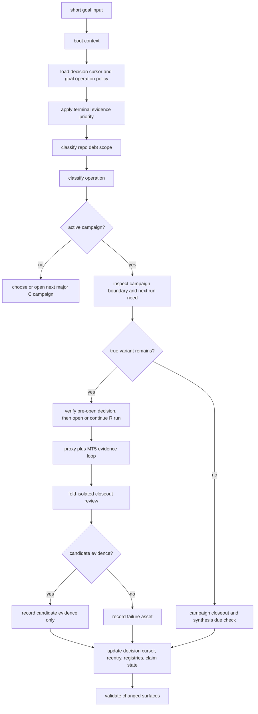

# Axiom Goal Campaign Operating Flow

This reference turns a short goal prompt into bounded campaign work. It does not create new claim authority.

## Short Goal Contract

A short `/goal` means: continue toward the active top-level Axiom target while obeying all active contracts, claim boundaries, and MT5 guardrails. It is not permission to skip evidence, change the objective, use archive files as truth, or close work because the current result is inconvenient.

## Flow

## Decision State Priority

Use `registries/decision_cursor.yaml` as a compact pointer before reentry history.
The cursor is not evidence and does not create claim authority.

Authority order for next-work decisions:

1. Run gate report decision/status.
2. Run manifest status.
3. Required KPI closeout receipts.
4. Artifact lineage deferred state.
5. Campaign active/closeout state.
6. `registries/claim_state.yaml` latest_operation.
7. `registries/reentry.yaml` next_work.

Completed history in `registries/reentry.yaml` is historical context only. If a
terminal run receipt conflicts with a stale planning pointer, terminal run
evidence wins.

## Repo Debt Scope

Repo-state errors stay visible. Classify debt before choosing work:

- known_nonblocking_for_next_run_decision: discovery may continue, but selected,
  promotion, handoff, and reproducibility claims remain blocked.
- active_path_blocker: repair before current run evidence or next-work decisions.
- closeout_blocker: current evidence may continue, but closeout is blocked.

Do not repair unrelated artifact hash debt during an active evidence loop unless
it blocks current evidence, closeout, selection, promotion, handoff, or a
reproducibility claim.

## Pre-Open Decision

Before opening a new run, record or verify a pre-open decision block. It must
show novelty score, changed surface distance, adjacent tuning risk, expected
information gain, MT5 portability, decision payoff, and failure memory used.

Do not open a run when expected information gain is low, adjacent tuning risk is
high, MT5 portability is non-portable, or the failure would only repeat known
negative memory.

## Operation Classes

new_campaign:
- Use when no active campaign exists and the next useful move is a new major hypothesis.
- Must preserve FPMarkets US100 M5 and the 5 to 10 entries-per-active-day target unless an active contract changes it.
- Must not open a campaign for threshold nudges, retry-only work, or adjacent tuning.
- Must keep labels, features, model families, objectives, and trade shapes unrestricted until explicit evidence-based freeze.

new_run:
- Use only inside an active campaign.
- Requires a distinct verification question and a meaningful surface change.
- Must identify fixed surfaces and changed surfaces.
- Opening a run commits to proxy plus MT5 evidence; weak proxy cannot stop MT5.

repair:
- Use for mechanical parity, intent parity, parser, runner, or evidence plumbing defects.
- Mechanical parity repair does not count as a new hypothesis variant.
- Intent repair or micro tuning counts toward run repair limits unless explicitly excluded by contract.

closeout:
- Use when evidence has answered the run or campaign question.
- Run closeout requires fold-isolated MT5 tick evidence and fold-isolated execution divergence, or a complete exception.
- Campaign closeout requires a synthesis due check.

synthesis:
- Use only when accumulated closed campaign evidence meets synthesis readiness.
- Negative memory and parity lessons may be ingredients.
- Evidence gaps disguised as ingredients are invalid.

pause:
- Use only when the next action requires a user choice or external state.
- Do not use pause as a way to avoid MT5 or closeout obligations.

## Evidence Loop For A Run

Required sequence:

1. Proxy KPI.
2. MT5 logic parity KPI.
3. Proxy-vs-MT5 logic parity KPI.
4. MT5 tick KPI.
5. Execution divergence KPI.
6. Fold-isolated MT5 tick KPI.
7. Fold-isolated execution divergence KPI.
8. Gate report and closeout.

Aggregate full-period MT5 KPI is diagnostic only. It can explain behavior but cannot close a run by itself.

## Failure Assets

Failure is not waste. Each failed run should leave at least one durable asset:

- negative_memory: a tested idea that should not be retried as-is
- parity_lesson: a logic mismatch or platform interpretation lesson
- execution_divergence_lesson: tick-vs-closed-bar or execution path behavior
- evidence_gap: a missing surface that blocked a stronger conclusion
- non_portable_lesson: a proxy idea that MT5 cannot represent faithfully

Failure assets must record the tested hypothesis, evidence paths, reason not candidate, and next boundary. Do not hide a failed run by omitting it, deleting it, or converting it into a selected claim.

## Broken Code Is Not Evidence

Code that does not run is not a hypothesis result. It is a repair surface or a blocker.

Never stop at "code did not work, recorded as failed." Required response:

1. Classify the failing surface: source code, parser, runner, MT5 terminal/config, data path, dependency, or command usage.
2. Inspect logs, outputs, and artifacts.
3. Repair code, runner, parser, or config when the fix is in project scope.
4. Rerun the same validation after repair.
5. Record evidence only after the run produces the expected artifact shape.

If repair is not possible in the current turn, record a blocker instead of a closeout. The blocker must include root cause, reproduction command, failing artifact path, next concrete repair step, and the user or external state required.

Missing KPI caused by broken code, parser failure, compile failure, or runner failure must not count as fold-isolated evidence, failure asset, or campaign closeout evidence.

## Sizing And Discovery Freedom

Early discovery uses fixed-lot evaluation to compare signal quality without compounding or sizing distortion.

Equity-percent sizing is allowed later for robustness or growth validation after candidate quality is established. Do not use equity sizing to rescue weak early discovery results, and do not freeze the exact sizing rule before candidate quality is established.

Feature count, feature families, model family, model count, ensembles, direction-specific models, exit models, score surfaces, filters, labels, objectives, and trade shapes remain exploration variables until an active contract or decision record freezes them with evidence.

## Run Closeout Git Sync

Every run closeout must end with local `main` reflecting the closeout-scoped changes and `main` pushed to `origin`.

Required sequence after validation:

1. Inspect `git status`.
2. Ensure the local branch is `main`.
3. Sync with `origin/main` without discarding work.
4. Stage closeout-scoped changes only.
5. Commit run closeout changes.
6. Push `main` to `origin`.
7. Report the commit and push result.

Do not report run closeout as operationally complete before the push succeeds. Do not force-push, hard reset, discard unrelated work, or stage unrelated files.

If git sync or push cannot complete because of auth, remote, conflict, or external state, record a blocker with root cause, reproduction command, next concrete repair step, and the user or external state required.

## Closeout Matrix

Continue the same run when:
- mechanical parity is unresolved
- intent repair has a clear remaining question and repair budget remains
- required evidence is missing because of tooling that can be repaired
- code, parser, runner, MT5 config, or artifact generation is broken

Open a new run when:
- the campaign boundary is still active
- a distinct verification question remains
- a required surface changes meaningfully
- the change is not a parameter nudge or retry

Close the run when:
- fold-isolated evidence answers the run question
- the repair path is exhausted
- the variant is non-portable
- further work would be adjacent tuning
- not when code simply failed to execute
- and closeout-scoped changes can be validated, committed on `main`, and pushed to `origin`

Close the campaign when:
- all meaningful variants inside the boundary are exhausted
- remaining work would be adjacent tuning or a new major hypothesis
- all relevant runs have closeout evidence
- synthesis due check is recorded

Open a new campaign when:
- the old campaign is closed
- the next idea changes the major hypothesis boundary
- synthesis is not due or does not block the campaign stream

## Done Definition

A goal operation is done when:

- the chosen operation class is clear
- changed artifacts are in canonical project paths
- no active claim exceeds `registries/claim_state.yaml`
- run or campaign status matches the evidence
- failures are recorded as assets when applicable
- reentry and registries point to the next honest action
- run closeout changes are committed on `main` and pushed to `origin` when a run was closed
- relevant validators pass or any blocked validator is reported in chat
